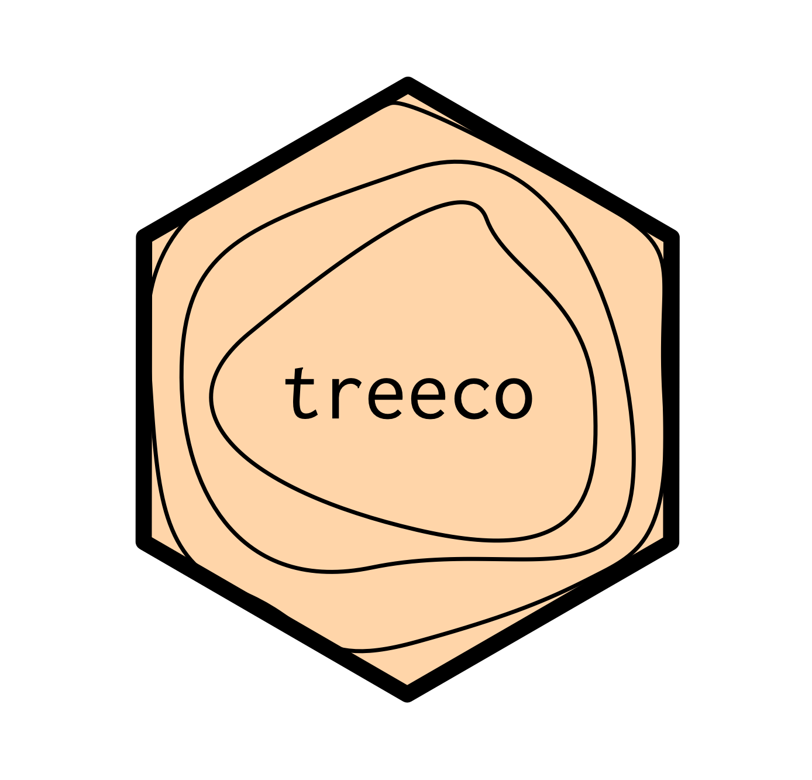
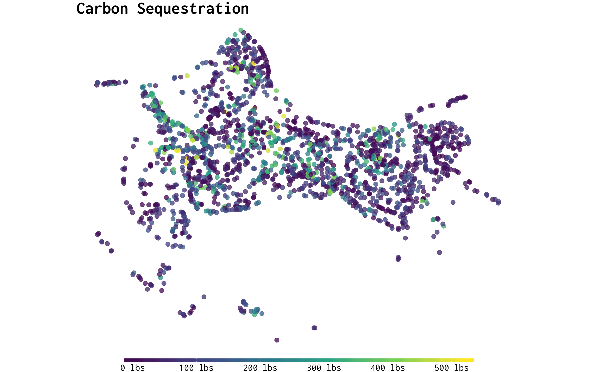

<!-- README.md is generated from README.Rmd. Please edit that file -->

```{r, echo = FALSE}
knitr::opts_chunk$set(
  collapse = TRUE,
  comment = "#>",
  fig.path = "README-"
)
```

# treeco 

[](https://travis-ci.org/tyluRp/treeco)
[](https://ci.appveyor.com/project/tyluRp/treeco)
[](https://codecov.io/github/tyluRp/treeco?branch=master)
[](https://www.tidyverse.org/lifecycle/#experimental)



The goal of `treeco` is to provide R users a tool for calculating the eco benefits of trees. All data used to calculate benefits is ripped from OpenStreetMaps [`otm-ecoservice`](https://github.com/OpenTreeMap/otm-ecoservice) repository which was (probably) ripped from [i-Tree](https://www.itreetools.org/)'s Eco or Streets software. A single tree is represented by 15 rows and 9 columns as there are 15 benefits calculated for every tree. Since tree inventories can be rather large, `treeco` utilizes the [`data.table`](https://github.com/Rdatatable/data.table) package for speed. All calculations are done on unique species/dbh pairs to avoid redundant computation. 

## Installation

`treeco` isn't available on CRAN but you can install it directly from github using [`devtools`](https://github.com/r-lib/devtools):

```r
# install.packages("devtools")
devtools::install_github("tylurp/treeco")
```

## A reproducible example

We can use the [`trees`](https://stat.ethz.ch/R-manual/R-patched/library/datasets/html/trees.html) dataset to demonstrate how `eco_guess` and `eco_run_all` works:

```{r, message=FALSE, warning=FALSE}
library(dplyr)
library(treeco)

df_trees <- trees %>% 
  mutate(common_name = "Black cherry") %>% 
  select(common_name, Girth) %>% 
  mutate(botanical_name = eco_guess(common_name, "botanical"))

eco_run_all(
  data = df_trees,                  # dataset or path to CSV
  common_col = "common_name",       # common name field
  botanical_col = "botanical_name", # botanical name field
  dbh_col = "Girth",                # dbh field
  region = "PiedmtCLT",             # region code
  n = 0.99,                         # optional, threshold for species guessing
  print_time = TRUE                 # optional, print elapsed time
  ) %>% as_tibble()
```

## More examples

Use `eco_run` to calculate benefits for a single tree:

```{r}
treeco::eco_run("Common fig", 20, "InlEmpCLM")
```

One issue with eco benefits is that they all rely on i-Tree's `master_species_list` which is a list of 3,000+ species, therefore a users data needs to fit this list in order to extract benefits. For example, "Fig tree" doesn't match i-Tree's "Common fig". So far, there really isn't a great solution to this. For now, `treeco` guesses the species code on the fly by quantifying the "similarity", anything below 90% similar is immediately discarded.

For example, if we misspell "Common fig" as "Commn fig":

```{r}
treeco::eco_run("Commn fig", 20, "InlEmpCLM")
```

If you are missing a field, you can use `eco_guess` to try and find it:

```{r}
x <- c("common fig", "red maple", "fir")
treeco::eco_guess(x, "botanical")
```
