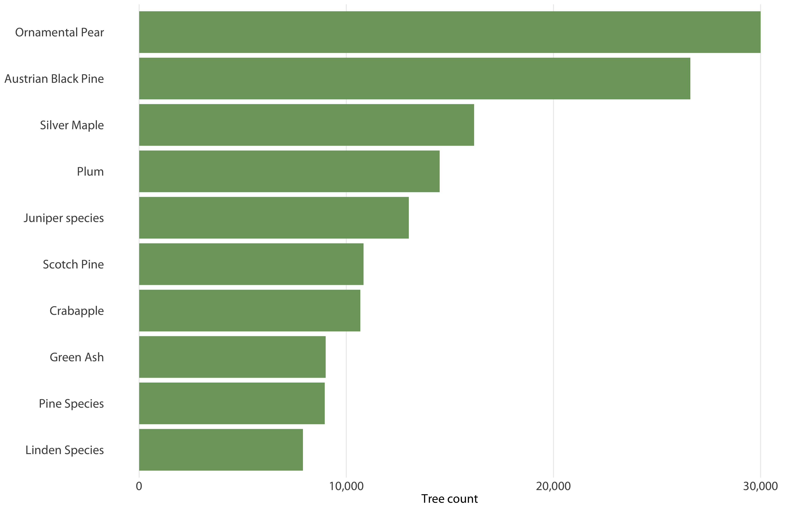

# treeco [](https://travis-ci.org/tyluRp/treeco) 


Eco benefits in R

## Installation

```r
# install.packages("devtools")
devtools::install_github("tylurp/treeco")
```

## Demo

We can compute 15 eco benefits for a Common fig in the Inland Empire region with a 20" DBH using the following:

```r
library(treeco)
eco_run("common fig", 20, "InlEmpCLM")

#    scientific_name common_name dbh benefit_value            benefit  unit
# 1     Ficus carica  Common fig  20        0.1102     aq nox avoided   kgs
# 2     Ficus carica  Common fig  20        0.1190         aq nox dep   kgs
# 3     Ficus carica  Common fig  20        0.3500       aq ozone dep   kgs
# 4     Ficus carica  Common fig  20        0.0273    aq pm10 avoided   kgs
# 5     Ficus carica  Common fig  20        0.1850        aq pm10 dep   kgs
# 6     Ficus carica  Common fig  20        0.2183     aq sox avoided   kgs
# 7     Ficus carica  Common fig  20        0.0160         aq sox dep   kgs
# 8     Ficus carica  Common fig  20        0.0273     aq voc avoided   kgs
# 9     Ficus carica  Common fig  20        0.0000               bvoc   kgs
# 10    Ficus carica  Common fig  20       55.7000        co2 avoided   kgs
# 11    Ficus carica  Common fig  20        4.1000    co2 sequestered   kgs
# 12    Ficus carica  Common fig  20      569.6000        co2 storage   kgs
# 13    Ficus carica  Common fig  20      189.2000        electricity   kwh
# 14    Ficus carica  Common fig  20        3.1600 hydro interception   m^3
# 15    Ficus carica  Common fig  20      -81.4000        natural gas kbtus
```

## Components

`treeco` has three available functions and two datasets: `eco_run.R`, `eco_run_all.R`, `eco_demo.R`, `eco_data` and `species_data`.

### eco_run.R

This function acts like a calculator similiar to [this one](http://www.treebenefits.com/calculator/) but much less content. `eco_run.R` takes and requires 3 arguments.

1. `species`: the common name of the species, if a match isn't found, the function will make it's best guess
2. `dbh`: the dbh value of a tree, this can be any sensible number (i.e. no negative numbers)
3. `region`: the region code, also found in `species_data` as well as `eco_data`

### eco_run_all.R

_Note: Currently a work in progress, use with caution_

This function calculates eco benefits for an entire tree inventory (slowly, hoping to make this faster). Calculating the eco benefits of 10,000 trees takes ~3-5 seconds but takes much longer for inventories with 200,000+ trees. `eco_run_all.R` takes and requires 4 arguments:

1. `data`: the path to a `csv` file containing the tree data
    * The `csv` must have the following 2 fields: common name for tree species and dbh for dbh values
2. `species_col`: the name of the common name field, case sensitive (for now).
3. `dbh_col`: the name of the dbh field, case sensitive (for now).
4. `region`: the region the trees are located in. You can see a list of the region codes and the region name in the `currency_data` dataset.

```r
library(treeco)

file_dir <- "/Users/tylerlittlefield/Desktop/treeco demo data/trees.csv"

df_trees <- eco_run_all(
  data = file_dir,        # data directory
  species_col = "COMMON", # name of my common name field
  dbh_col = "EXACT_DBH",  # name of my dbh field
  region = "SoCalCSMA"    # region
  )

# Importing: trees.csv...
# trees.csv imported.
# Reconfiguring data...
# Data reconfigured.
# Guessing species codes...
# Species codes gathered.
# Linking species codes to the data...
# Species codes linked.
# Calculating benefits for 12504 trees...
# Complete.
# 
#            id           scientific_name            common_name dbh benefit_value            benefit  unit dollars
#      1:     2 Cupaniopsis anacardioides            Carrot Wood  15        0.0880     aq nox avoided   lbs    1.45
#      2:     2 Cupaniopsis anacardioides            Carrot Wood  15        0.2800         aq nox dep   lbs    4.60
#      3:     2 Cupaniopsis anacardioides            Carrot Wood  15        0.6041       aq ozone dep   lbs    9.93
#      4:     2 Cupaniopsis anacardioides            Carrot Wood  15        0.0212    aq pm10 avoided   lbs    1.09
#      5:     2 Cupaniopsis anacardioides            Carrot Wood  15        0.3483        aq pm10 dep   lbs   17.88
#     ---                                                                                                          
# 187541: 19187       Podocarpus henkelii Long-Leafed Yellowwood   1        2.5721    co2 sequestered   lbs    0.04
# 187542: 19187       Podocarpus henkelii Long-Leafed Yellowwood   1       -7.0916        co2 storage   lbs    0.11
# 187543: 19187       Podocarpus henkelii Long-Leafed Yellowwood   1       -0.1333        electricity   kwh    0.02
# 187544: 19187       Podocarpus henkelii Long-Leafed Yellowwood   1       10.1178 hydro interception  gals    0.02
# 187545: 19187       Podocarpus henkelii Long-Leafed Yellowwood   1        4.2333        natural gas kbtus    0.06
```
<p align="center"> 

</p>

### eco_interp.R

This function is nested in `eco_run.R`. It interpolates benefit values (always) and will eventually interpolate values only when necessary. The following equation is used:

<p align="center"><a href="http://www.codecogs.com/eqnedit.php?latex=y&space;=&space;\frac{(x&space;-&space;x1)(y2&space;-&space;y1)}{x2&space;-&space;x1}&space;&plus;&space;y1" target="_blank"></a></p>

### eco_guess.R

This function guesses the user input for the `species` argument when a match isn't found. For example, "comon fig" will be interpreted as "common fig":

```r
eco_run("comon fig", 20, "InlEmpCLM")

# Species given: [comon fig]
# Closest match: [common fig]
# ...
# Using closest match
#    scientific_name common_name dbh benefit_value            benefit  unit
# 1     Ficus carica  Common fig  20        0.1102     aq nox avoided   kgs
# 2     Ficus carica  Common fig  20        0.1190         aq nox dep   kgs
# 3     Ficus carica  Common fig  20        0.3500       aq ozone dep   kgs
# 4     Ficus carica  Common fig  20        0.0273    aq pm10 avoided   kgs
# 5     Ficus carica  Common fig  20        0.1850        aq pm10 dep   kgs
# 6     Ficus carica  Common fig  20        0.2183     aq sox avoided   kgs
# 7     Ficus carica  Common fig  20        0.0160         aq sox dep   kgs
# 8     Ficus carica  Common fig  20        0.0273     aq voc avoided   kgs
# 9     Ficus carica  Common fig  20        0.0000               bvoc   kgs
# 10    Ficus carica  Common fig  20       55.7000        co2 avoided   kgs
# 11    Ficus carica  Common fig  20        4.1000    co2 sequestered   kgs
# 12    Ficus carica  Common fig  20      569.6000        co2 storage   kgs
# 13    Ficus carica  Common fig  20      189.2000        electricity   kwh
# 14    Ficus carica  Common fig  20        3.1600 hydro interception   m^3
# 15    Ficus carica  Common fig  20      -81.4000        natural gas kbtus
```

### string_dist.R

This function calculates the similarity of two strings and allows `eco_guess.R` to do it's thing.

### eco_demo.R

This is just a demo function that executes:

```r
eco_run(species = "FICA", dbh = 20, region = "InlEmpCLM")
```

## Future plans

* An Imperial/Metric arugment to display units differently depending on what the user wants.
* Better documentation, a vignette
* Add monetary values to benefits
* Suppress messages option
