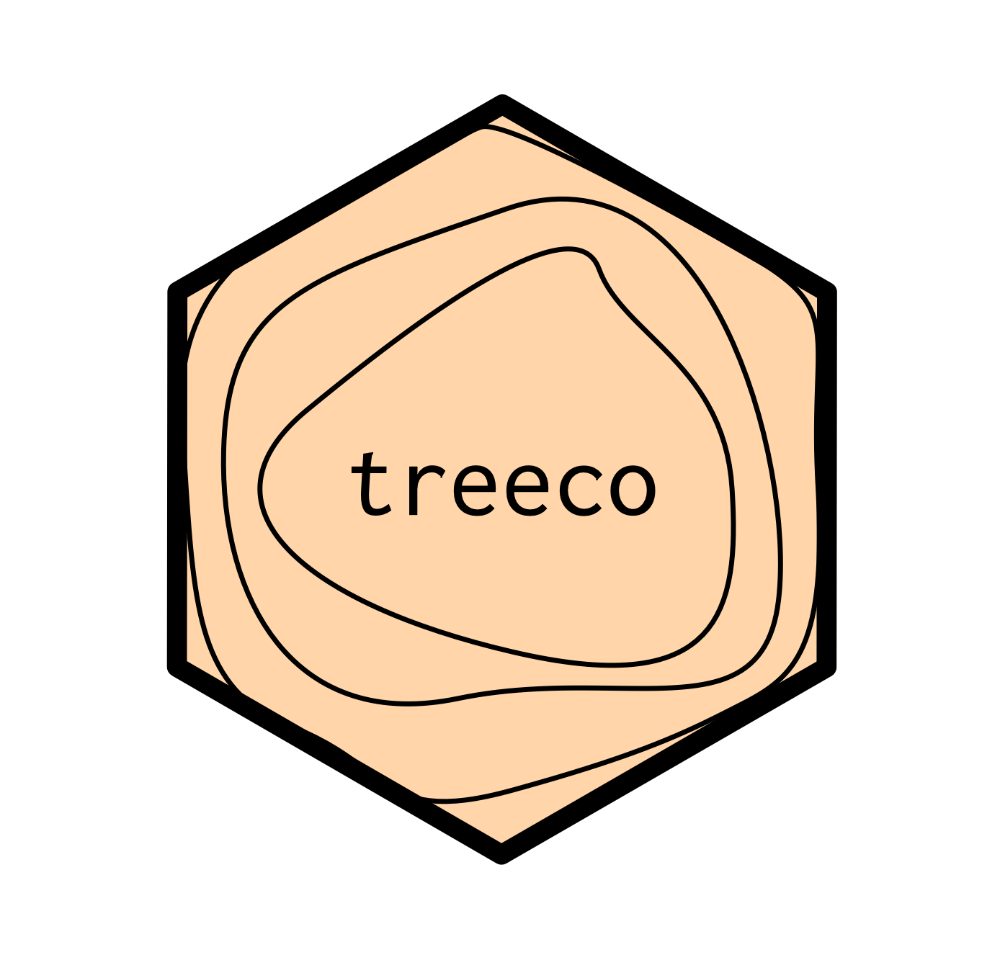
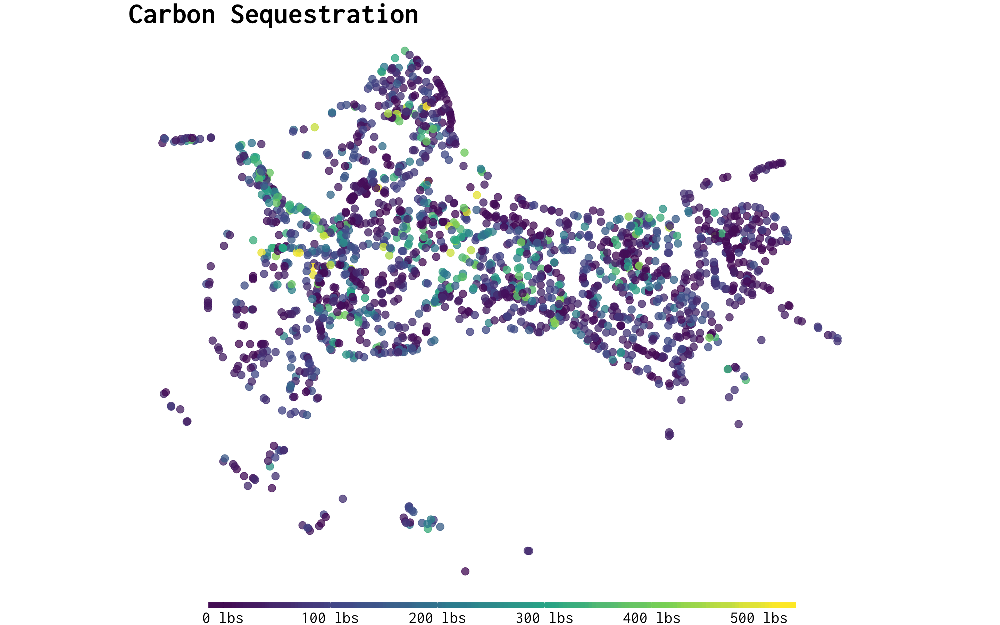

<!-- README.md is generated from README.Rmd. Please edit that file -->

# treeco 

[](https://travis-ci.org/tyluRp/treeco)
[](https://ci.appveyor.com/project/tyluRp/treeco)
[](https://codecov.io/github/tyluRp/treeco?branch=master)
[](https://www.tidyverse.org/lifecycle/#experimental)



The goal of `treeco` is to provide R users a tool for calculating the
eco benefits of trees. All data used to calculate benefits is ripped
from OpenStreetMaps
[`otm-ecoservice`](https://github.com/OpenTreeMap/otm-ecoservice)
repository which was (probably) ripped from
[i-Tree](https://www.itreetools.org/)’s Eco or Streets software. A
single tree is represented by 15 rows and 8 columns as there are 15
benefits calculated for every tree. Since tree inventories can be rather
large, `treeco` utilizes the
[`data.table`](https://github.com/Rdatatable/data.table) package for
speed. All calculations are done on unique species/dbh pairs to avoid
redundant computation.

## Installation

`treeco` isn’t available on CRAN but you can install it directly from
github using [`devtools`](https://github.com/r-lib/devtools):

``` r
# install.packages("devtools")
devtools::install_github("tylurp/treeco")
```

## A reproducible example

We can use the
[`trees`](https://stat.ethz.ch/R-manual/R-patched/library/datasets/html/trees.html)
dataset to demonstrate how `eco_guess` and `eco_run_all` works:

``` r
library(dplyr)
library(treeco)

df_trees <- trees %>% 
  mutate(common_name = "Black cherry") %>% 
  select(common_name, Girth) %>% 
  mutate(botanical_name = eco_guess(common_name, "botanical"))

eco_run_all(
  data = df_trees,                  # dataset or path to CSV
  common_col = "common_name",       # common name field
  botanical_col = "botanical_name", # botanical name field
  dbh_col = "Girth",                # dbh field
  region = "PiedmtCLT",             # region code
  n = 0.99,                         # optional, threshold for species guessing
  ) %>% as_tibble()
#> # A tibble: 465 x 8
#>    botanical    common     dbh benefit_value benefit   unit  dollars rn   
#>    <chr>        <chr>    <dbl>         <dbl> <chr>     <chr>   <dbl> <chr>
#>  1 prunus sero… black c…   8.3        0.0776 aq nox a… lb       0.51 1    
#>  2 prunus sero… black c…   8.3        0.026  aq nox d… lb       0.17 1    
#>  3 prunus sero… black c…   8.3        0.0556 aq ozone… lb       0.36 1    
#>  4 prunus sero… black c…   8.3        0.015  aq pm10 … lb       0.04 1    
#>  5 prunus sero… black c…   8.3        0.0633 aq pm10 … lb       0.16 1    
#>  6 prunus sero… black c…   8.3        0.165  aq sox a… lb       0.32 1    
#>  7 prunus sero… black c…   8.3        0.0119 aq sox d… lb       0.02 1    
#>  8 prunus sero… black c…   8.3        0.0146 aq voc a… lb       0.09 1    
#>  9 prunus sero… black c…   8.3       -0.338  bvoc      lb       2.12 1    
#> 10 prunus sero… black c…   8.3       30.3    co2 avoi… lb       0.23 1    
#> # ... with 455 more rows
```

## More examples

Use `eco_run` to calculate benefits for a single tree:

``` r
treeco::eco_run("Common fig", 20, "InlEmpCLM")
#>     common_name dbh benefit_value            benefit unit dollars
#>  1:  Common fig  20        0.2429     aq nox avoided   lb    0.93
#>  2:  Common fig  20        0.2623         aq nox dep   lb    1.01
#>  3:  Common fig  20        0.7716       aq ozone dep   lb    2.96
#>  4:  Common fig  20        0.0602    aq pm10 avoided   lb    0.28
#>  5:  Common fig  20        0.4079        aq pm10 dep   lb    1.89
#>  6:  Common fig  20        0.4813     aq sox avoided   lb    1.17
#>  7:  Common fig  20        0.0353         aq sox dep   lb    0.09
#>  8:  Common fig  20        0.0602     aq voc avoided   lb    0.12
#>  9:  Common fig  20        0.0000               bvoc   lb    0.00
#> 10:  Common fig  20      122.7973        co2 avoided   lb    0.41
#> 11:  Common fig  20        9.0389    co2 sequestered   lb    0.03
#> 12:  Common fig  20     1255.7516        co2 storage   lb    4.19
#> 13:  Common fig  20      189.2000        electricity  kwh   38.12
#> 14:  Common fig  20      834.7837 hydro interception  gal    4.59
#> 15:  Common fig  20     -179.4561        natural gas   lb    1.20
```

One issue with eco benefits is that they all rely on i-Tree’s
`master_species_list` which is a list of 3,000+ species, therefore a
users data needs to fit this list in order to extract benefits. For
example, “Commn fig” doesn’t match i-Tree’s “Common fig” because of the
typo. So far, there really isn’t a great solution to this. For now,
`treeco` guesses the species code on the fly by quantifying the
“similarity”, anything below 90% similar is immediately discarded.

For example, if we misspell “Common fig” as “Commn fig”:

``` r
treeco::eco_run("Commn fig", 20, "InlEmpCLM")
#> Species given: [commn fig]
#> Closest match: [common fig]
#> ...
#> Using closest match
#>     common_name dbh benefit_value            benefit unit dollars
#>  1:  Common fig  20        0.2429     aq nox avoided   lb    0.93
#>  2:  Common fig  20        0.2623         aq nox dep   lb    1.01
#>  3:  Common fig  20        0.7716       aq ozone dep   lb    2.96
#>  4:  Common fig  20        0.0602    aq pm10 avoided   lb    0.28
#>  5:  Common fig  20        0.4079        aq pm10 dep   lb    1.89
#>  6:  Common fig  20        0.4813     aq sox avoided   lb    1.17
#>  7:  Common fig  20        0.0353         aq sox dep   lb    0.09
#>  8:  Common fig  20        0.0602     aq voc avoided   lb    0.12
#>  9:  Common fig  20        0.0000               bvoc   lb    0.00
#> 10:  Common fig  20      122.7973        co2 avoided   lb    0.41
#> 11:  Common fig  20        9.0389    co2 sequestered   lb    0.03
#> 12:  Common fig  20     1255.7516        co2 storage   lb    4.19
#> 13:  Common fig  20      189.2000        electricity  kwh   38.12
#> 14:  Common fig  20      834.7837 hydro interception  gal    4.59
#> 15:  Common fig  20     -179.4561        natural gas   lb    1.20
```

If you are missing a field, you can use `eco_guess` to try and find it:

``` r
x <- c("common fig", "red maple", "fir")
treeco::eco_guess(x, "botanical")
#> [1] "Ficus carica" "Acer rubrum"  "Abies spp"
```
